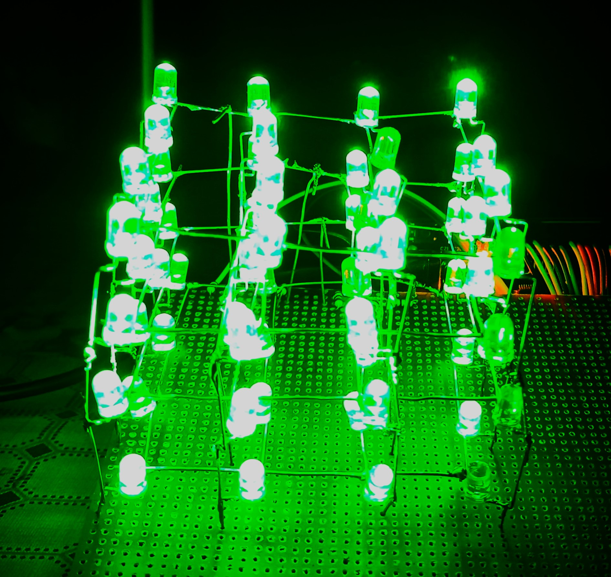

# 4x4x4 LED Cube using Arduino UNO

This project demonstrates the creation of a **4x4x4 LED Cube** controlled by an **Arduino UNO**. The cube consists of 64 LEDs arranged in a 3D grid, allowing for complex lighting patterns, animations, and effects.

## Features

- **LED Cube Setup**: A 4x4x4 matrix of LEDs controlled using Arduino UNO.
- **Animation Effects**: Several pre-programmed effects such as flickering, spiraling, random patterns, and edge effects.
- **Arduino-based Control**: The cube is controlled through pin manipulation on the Arduino UNO.

## Hardware Requirements

- **Arduino UNO**
- **4x4x4 LED Cube**
- **Resistors and Wires** for connecting the LEDs to the Arduino

## Circuit Diagram

### Pin Configuration

- **Layer Pins**: A0, A1, A2, A3 (connected to layers of the LED cube)
- **Column Pins**: 0, 1, 2, 3, 4, 5, 6, 7, 8, 9, 10, 11, 12, 13, A4, A5 (connected to columns of the LED cube)

## Setup

1. Connect the **layer pins** (A0 to A3) of the Arduino to the respective layer pins of the LED cube.
2. Connect the **column pins** (0 to A5) of the Arduino to the corresponding columns of the LED cube.
3. Ensure proper current-limiting resistors are in place to prevent damage to the LEDs.
4. Upload the Arduino code to control the LED cube with various effects and animations.

## Code Overview

The project uses simple digitalWrite commands to control each LED in the cube by activating the corresponding layers and columns. Some of the effects implemented in the code include:

- **Flicker Effect**: A random flickering pattern.
- **Spiral Effect**: A spiraling animation that moves the LEDs in and out of the cube.
- **Edge Effect**: LEDs light up in a pattern along the edges of the cube.
- **Random Rain**: LEDs light up randomly, mimicking a rain effect.
- **Diagonal Rectangle**: A moving rectangle pattern.

## Contributions

Feel free to fork the repository and submit your own modifications and improvements! Pull requests are welcome.

## License

This project is open-source and available under the [MIT License](LICENSE).
